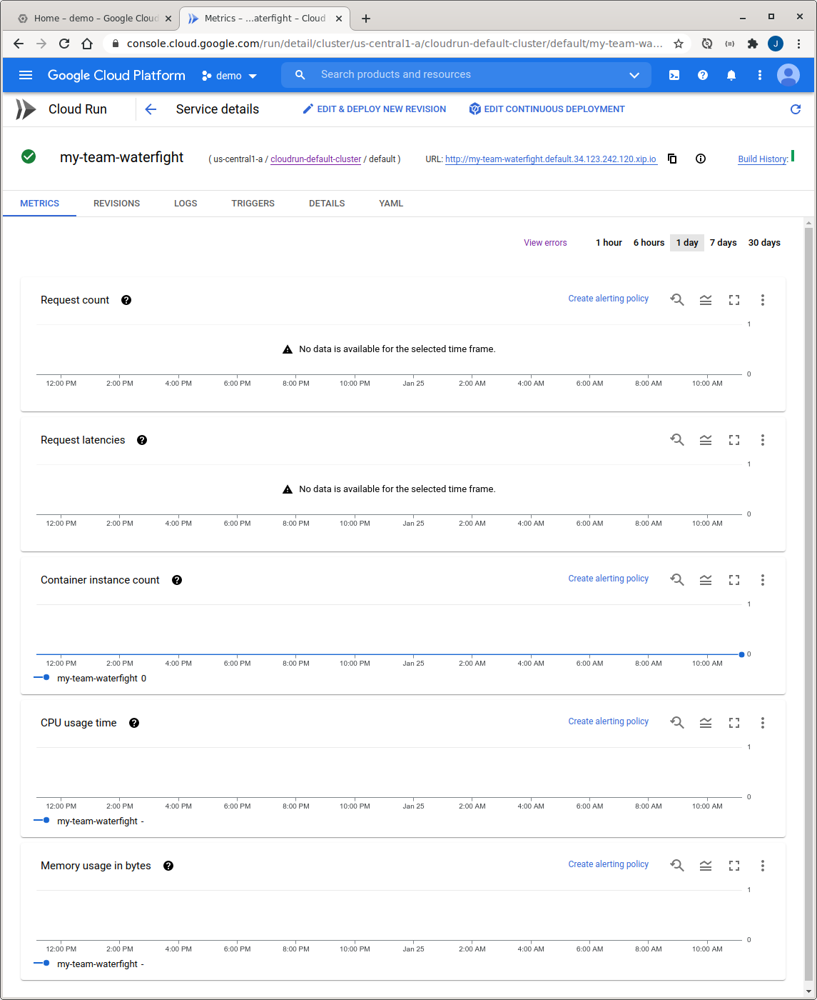

# Green Tomato Cloud Run Hackathon


## Introduction


**Last Updated:** 2021-10-02 11:15

Ever been in a water fight where you move around and playfully spray others with water? If not, try it someday! But now instead of risking getting actually wet, you can build a small, network accessible service (a microservice) that will take part in an epic water fight against other microservices.

You might be wondering... But how does a microservice spray water at other microservices? A microservice can receive network requests (usually over HTTP) and return responses. There is an "arena manager" that will send your microservice the current state of the arena and then your microservice will respond with a command specifying what to do.

Of course the goal is to win, but along the way you'll learn about building and deploying microservices on Google Cloud.

#### How It Works

You will build a microservice with any technology you want (or choose from Go, Java, Kotlin, Scala, NodeJS, or Python starters) and then deploy the microservice on Google Cloud. Once deployed, you'll let us know the URL for your microservice and then we will add it to the arena.

The arena contains all of the players for a given battle. The Laugh and Learn Battle will have its own arenas. Each player represents a microservice that moves around and throws smileys at the other players.

About once a second our arena manager will call your microservice, sending the current arena state (where the players are), and your microservice will respond with a command for what to do. In the arena you can move forward, turn left or right, or throw a smiley. A smiley will travel up to three spaces in the direction the player is facing. If the smiley "hits" another player, the thrower gets one point and the hit player loses a point. The arena size is auto-adjusted for the current number of players.

Here is how a past arena looks:


*Example Battle One arena*

#### Revolving Conflicts

In the arena it is possible that multiple players try to perform conflicting actions. For instance, two players might try to move to the same space. In the case of a conflict, the microservice with the quickest response time wins.

#### Watching the Battle

To see how your microservice is doing in the battle,  [check out the live arena](http://cloudbowl-web.default.anthos.derrick.hk/)!

### Battle API

In order to work with our arena manager, your microservice will need to implement a specific API to participate in the arena.  The arena manager will send the current arena state in an HTTP POST to the URL you provide us, with the following JSON structure:

```
{
  "_links": {
    "self": {
      "href": "https://YOUR_SERVICE_URL"
    }
  },
  "arena": {
    "dims": [4,3], // width, height
    "state": {
      "https://A_PLAYERS_URL": {
        "x": 0, // zero-based x position, where 0 = left
        "y": 0, // zero-based y position, where 0 = top
        "direction": "N", // N = North, W = West, S = South, E = East
        "wasHit": false,
        "score": 0
      }
      ... // also you and the other players
    }
  }
}
```

Your HTTP response must be status code 200 (OK) with a response body containing your next move, encoded as a single uppercase character of either:

```
F <- move Forward
R <- turn Right
L <- turn Left
T <- Throw
```

That's all there is to it!  Let's walk through deploying a microservice on  [Cloud Run](https://cloud.google.com/run), a Google Cloud service for running microservices and other applications.


## Login to Google Cloud
Duration: 05:00


The web console we will be using should work great with Chrome or Firefox but might have issues in Safari.


## Deploying Your Microservice
Duration: 15:00


You can build your microservice with any technology and deploy it anywhere as long as it is reachable publicly and conforms to the Battle API.  But to make things easy we will help you start from a sample service and deploy it on Cloud Run.

#### Launch Cloud Shell

We will start in  [Cloud Shell](https://cloud.google.com/shell/docs), a cloud-based personal computer and clone the repository (repo) containing the starter sample code.

1.  [Launch Cloud Shell & Clone Samples](http://ssh.cloud.google.com/?cloudshell_git_repo=https://github.com/GoogleCloudPlatform/cloudbowl-microservice-game.git&show=terminal) (this will open your shell and clone) 


2. List your projects and set an  [environment variable](https://medium.com/chingu/an-introduction-to-environment-variables-and-how-to-use-them-f602f66d15fa) for the project:

```console
gcloud projects list

export PROJECT_ID=<YOUR_PROJECT_ID>

<pick one of the regions below>
export REGION=us-central1
export REGION=asia-east1
export REGION=asia-northeast1
export REGION=asia-south2
export REGION=asia-southeast1
export REGION=asia-southeast2
export REGION=europe-central2
export REGION=us-west2
export REGION=us-west3
```

3. Enable the necessary APIs. We enable APIs explicitly in GCP projects so you can use them. It is common to not enable APIs so they are not mis(used):

```console
gcloud services enable \
  container.googleapis.com \
  containerregistry.googleapis.com \
  cloudbuild.googleapis.com \
  cloudapis.googleapis.com \
  run.googleapis.com \
  --project=$PROJECT_ID
```

#### Pick Your Sample To Start With

There are eight battle microservice samples you can start from. Each are represented by a different programming language but are functionally the same:

| Sample | Description |
| --- | --- |
| <a href="https://github.com/GoogleCloudPlatform/cloudbowl-microservice-game/blob/master/samples/go" target="_blank">go</a> | Go Lang |
| <a href="https://github.com/GoogleCloudPlatform/cloudbowl-microservice-game/blob/master/samples/java-quarkus" target="_blank">java-quarkus</a> | Java + Quarkus |
| <a href="https://github.com/GoogleCloudPlatform/cloudbowl-microservice-game/blob/master/samples/java-springboot" target="_blank">java-springboot</a> | Java + Spring Boot |
| <a href="https://github.com/GoogleCloudPlatform/cloudbowl-microservice-game/blob/master/samples/kotlin-micronaut" target="_blank">kotlin-micronaut</a> | Kotlin + Micronaut |
| <a href="https://github.com/GoogleCloudPlatform/cloudbowl-microservice-game/blob/master/samples/kotlin-quarkus" target="_blank">kotlin-quarkus</a> | Kotlin + Quarkus |
| <a href="https://github.com/GoogleCloudPlatform/cloudbowl-microservice-game/blob/master/samples/kotlin-springboot" target="_blank">kotlin-springboot</a> | Kotlin + Spring Boot |
| <a href="https://github.com/GoogleCloudPlatform/cloudbowl-microservice-game/blob/master/samples/nodejs" target="_blank">nodejs</a> | Node.js |
| <a href="https://github.com/GoogleCloudPlatform/cloudbowl-microservice-game/blob/master/samples/python" target="_blank">Python</a>  | Python + Flask |

Back in Cloud Shell, set another environment variable for the sample you'd like to use:

```console
# Copy and paste ONLY ONE of these
export SAMPLE=go
export SAMPLE=java-quarkus    
export SAMPLE=java-springboot
export SAMPLE=kotlin-micronaut
export SAMPLE=kotlin-quarkus
export SAMPLE=kotlin-springboot
export SAMPLE=nodejs
export SAMPLE=python
```

#### Deploy Your Microservice on Cloud Run

You can now deploy your container image on Cloud Run. 

```console
gcloud run deploy $SAMPLE-bot \
  --project=$PROJECT_ID \
  --region=$REGION \
  --allow-unauthenticated \
  --source=<YOUR APP FOLDER> 
```

You will see something like below

```console
This service will require authentication to be invoked.
Building using Buildpacks and deploying container to Cloud Run service [my-bot] in project [qwiklabs-gcp-03-f1582d89eb20] region [$REGION]
OK Building and deploying new service... Done.                                                           
  OK Creating Container Repository...
  OK Uploading sources...
  OK Building Container... Logs are available at [https://console.cloud.google.com/cloud-build/builds/03d1aa6b-d909-4b5b-9533-67a75855c046?project=736905545822].
  OK Creating Revision...
  OK Routing traffic...
Done.
Service [my-bot] revision [my-bot-00001-fer] has been deployed and is serving 100 percent of traffic.
Service URL: https://my-bot-wsz4zlbolq-uc.a.run.app
```

#### Verify the microservice works

In Cloud Shell you can make a request to your newly deployed microservice:

```console
export SVC_URL=$(gcloud run services describe $SAMPLE-bot \
  --project=$PROJECT_ID \
  --platform=managed \
  --region=$REGION \
  --format="value(status.url)")


curl -d '{
  "_links": {
    "self": {
      "href": "https://foo.com"
    }
  },
  "arena": {
    "dims": [4,3],
    "state": {
      "https://foo.com": {
        "x": 0,
        "y": 0,
        "direction": "N",
        "wasHit": false,
        "score": 0
      }
    }
  }
}' -H "Content-Type: application/json" -X POST -w "\n" \
  $SVC_URL
```

You should see the response string of either `F`, `L`, `R`, or `T`.


## Join the Arena
Duration: 05:00


To join the battle you will need to join an arena.  Open  [http://cloudbowl-web.default.anthos.derrick.hk/test/join](http://cloudbowl-web.default.anthos.derrick.hk/test/join)and provide your microservice URL.


## Make & Deploy Changes
Duration: 15:00


Make sure you still have the env vars set correctly:

```
echo $PROJECT_ID
echo $SAMPLE
```

Now, you can edit the source for your microservice from within Cloud Shell.  To open the Cloud Shell web-based editor, run this command:

```
cloudshell edit ~/cloudshell_open/cloudbowl-microservice-game/samples/$SAMPLE/README.md
```

You will then see further instructions for making changes.


*Cloud Shell with the editor with the sample project open*

After saving your changes, start the application in Cloud Shell using the command from the `README.md` file but first make sure you are in the correct sample directory in Cloud Shell:

```
cd ~/cloudshell_open/cloudbowl-microservice-game/samples/$SAMPLE
```

Once the application is running, open a new Cloud Shell tab and test the service using curl:

```
curl -d '{
  "_links": {
    "self": {
      "href": "https://foo.com"
    }
  },
  "arena": {
    "dims": [4,3],
    "state": {
      "https://foo.com": {
        "x": 0,
        "y": 0,
        "direction": "N",
        "wasHit": false,
        "score": 0
      }
    }
  }
}' -H "Content-Type: application/json" -X POST -w "\n" \
  http://localhost:8080
```

When you are ready to deploy your changes, deploy the new version on Cloud Run:

```console
gcloud run deploy $SAMPLE-bot \
  --project=$PROJECT_ID \
  --region=$REGION \
  --allow-unauthenticated \ 
  --source=<YOUR APP FOLDER> 
```

Now the arena will use your new version!

NOTE: If your Cloud Shell instance times out, your code changes will be lost so you'll likely want to develop locally / setup an SCM to preserve changes.


## Continuous Delivery
Duration: 20:00


### Setup SCM

Setup GitHub:

1.  [Login to GitHub](https://github.com/login)
2.  [Create a new repo](https://github.com/new) NOTE: Only use lowercase characters for the repo name!
3. If you are working on your local machine you can either use the git command line interface (CLI) or the GitHub Desktop GUI application (Windows or Mac).  If you are using Cloud Shell, you'll have to use the git CLI.  To get your microservice's code on GitHub, follow either the CLI or GitHub Desktop instructions.

### Push your code with the git CLI

1. Follow the  [git over https instructions](https://docs.github.com/en/github/authenticating-to-github/creating-a-personal-access-token) to  [create a personal token](https://github.com/settings/tokens)
2. Choose "repo" scope
3. Setup git:

```
git config --global credential.helper \
  'cache --timeout=172800'
git config --global push.default current
git config --global user.email "YOUR@EMAIL"
git config --global user.name "YOUR NAME"
```

4. Set env vars for the GitHub org and repo (`https://github.com/ORG/REPO`)

```
export GITHUB_ORG=YOUR_GITHUB_ORG
export GITHUB_REPO=YOUR_GITHUB_REPO
```

5. Push your code to the new repo
Make sure the SAMPLE env var is still set. If not, re-set it.

```
cd ~/cloudshell-open/cloudbowl-microservice-game/samples/$SAMPLE
git init
git add .
git commit -m init
git remote add origin https://github.com/$GITHUB_ORG/$GITHUB_REPO.git
git branch -M main

# This will now ask for your GitHub username & password
# for the password use the personal access token
git push -u origin main
```

6. After making any changes you can commit and push the changes to GitHub:

```
git add .
git status
git diff --staged
git commit -am "my changes"
git push
```

### Push your code with GitHub desktop (Optional)

1. Download your code using the instructions from the previous "Develop Locally" lab
2.  [Install GitHub Desktop](https://desktop.github.com/), launch it, and login
3. Clone your newly created repo


4. Open your file explorer and copy your project into the new repo
5. Commit your changes


6. Publish your main branch to GitHub

### Setup Continuous Deployment

With your SCM setup on GitHub you can now setup Continuous Delivery so that every time new commits are pushed to the `main` branch, Cloud Build will automatically build and deploy the changes.  You can also add Continuous Integration which runs your tests before deploying, but that step has been left as an exercise for you since the out-of-the-box samples do not contain any tests.

1.  [In the Cloud console](https://console.cloud.google.com/run), go to your Cloud Run service 
2. Click the "SET UP CONTINUOUS DEPLOYMENT" button


3. Authenticate with GitHub and select your microserivce's repository


4. Select your GitHub repo and set the branch to: `^main$`


5. Set the Build Type to use Buildpacks
6. Click Save to setup Continuous Deployment.

You might now see the following error message but, don't worry, everything is ok


## Observability
Duration: 15:00


Things break. Observability gives us the ability to know when that happens and diagnose why.  Metrics show us data about the health and usage of our service.  Logs shows us the manually instrumented information emitted from our service.  Alerts allow us to be notified when something goes wrong.  Let's explore each of those further.

### Metrics

1. Find your service in the  [list of Cloud Run services](https://console.cloud.google.com/run?project=jan-2021-hackathon)
2. Click on your service's name to visit it's metric dashboard



3. Click on a metric's **⋮** menu, then select "View in Metrics Explorer"
4. You can now change resource metrics, filters, grouping, and other options.  For instance, you can  [view mean service latencies](https://console.cloud.google.com/monitoring/metrics-explorer?pageState=%7B%22xyChart%22:%7B%22dataSets%22:%5B%7B%22timeSeriesFilter%22:%7B%22filter%22:%22metric.type%3D%5C%22run.googleapis.com%2Frequest_latencies%5C%22%20resource.type%3D%5C%22cloud_run_revision%5C%22%20resource.label.%5C%22project_id%5C%22%3D%5C%22jan-2021-hackathon%5C%22%22,%22minAlignmentPeriod%22:%2260s%22,%22unitOverride%22:%22ms%22,%22aggregations%22:%5B%7B%22perSeriesAligner%22:%22ALIGN_DELTA%22,%22crossSeriesReducer%22:%22REDUCE_MEAN%22,%22groupByFields%22:%5B%22resource.label.%5C%22service_name%5C%22%22%5D%7D,%7B%22crossSeriesReducer%22:%22REDUCE_NONE%22%7D%5D%7D,%22targetAxis%22:%22Y1%22,%22plotType%22:%22LINE%22%7D%5D,%22options%22:%7B%22mode%22:%22COLOR%22%7D,%22constantLines%22:%5B%5D,%22timeshiftDuration%22:%220s%22,%22y1Axis%22:%7B%22label%22:%22y1Axis%22,%22scale%22:%22LINEAR%22%7D%7D,%22isAutoRefresh%22:true,%22timeSelection%22:%7B%22timeRange%22:%221h%22%7D%7D&project=jan-2021-hackathon) for all services:


### Logs

STDOUT output from services is sent to the Google Cloud Logging system.  You can access a basic log view from the Cloud Run service admin page, like:


In the Cloud Run logs you can filter by severity and filter the logs.  For more flexibility click: 

### Alerts

1. Create a heathcheck URL for your service.

1. For Spring Boot, just add the following dependency:

```
org.springframework.boot:spring-boot-starter-actuator
```

2. Create or update the `src/main/resources/application.properties` and disable the diskspace check:

```
management.health.diskspace.enabled=false
```

2.  [Create an uptime alert](https://console.cloud.google.com/monitoring/uptime?project=jan-2021-hackathon), specifying your protocol, hostname, and path. For Spring Boot the path is: `/actuator/health`
3. Test the alert


4. Create the alert


## Congratulations


Congratulations, you've successfully built and deployed a microservice that can battle with other microservices!  Good luck!

### Reference Docs

*  [Cloud Run Docs](https://cloud.google.com/run/docs/)


